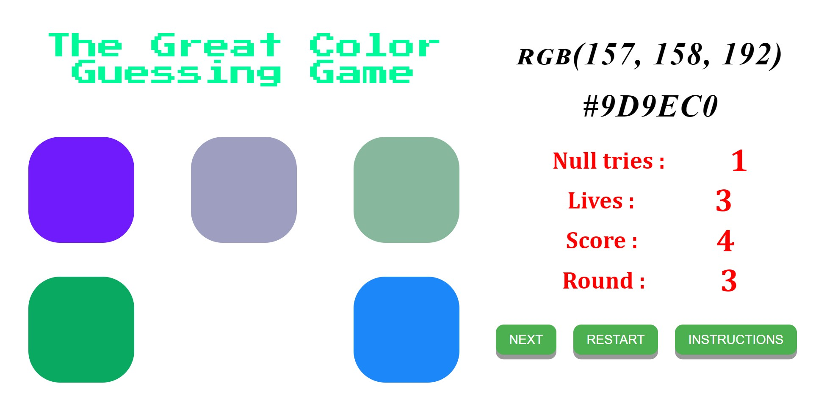

# Color Game v2.0
> A simple web game

## Table of contents
* [General info](#general-info)
* [Screenshots](#screenshots)
* [Setup](#setup)
* [Contact](#contact)

## General info
A simple web development project to test the knowledge of RGB and HEX values of colors

## Screenshots

## Setup
Go the this page [Color Game](https://IshanJain01.github.io/ColorGame/) and start playing

## Contact
Created by [@IshanJain01](https://github.com/IshanJain01) 